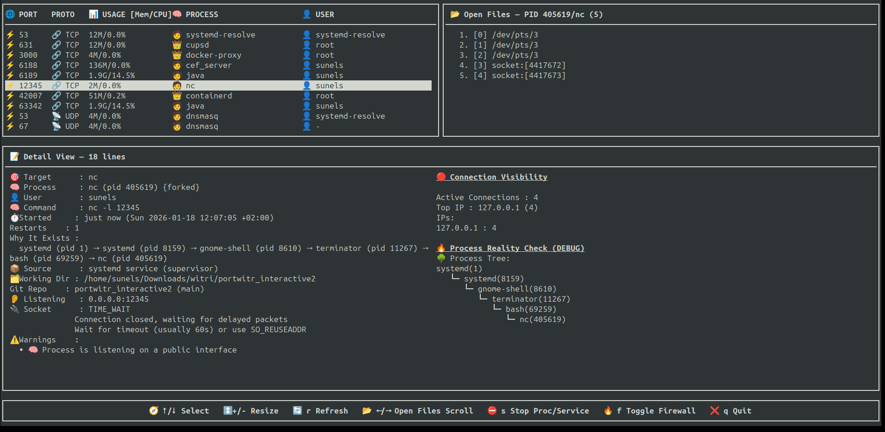

# portwitr-interactive — Wiki

Welcome to the official documentation for **portwitr-interactive**.

This wiki provides a deep dive into the architecture, features, and usage patterns of the application, helping you understand **how Linux ports, processes, resources, firewall rules, and files are connected** — and how to explore them interactively.
---

<p align="left">
  
</p>

---

<p align="center">
  
</p>

---

<p align="center">
  
</p>

## What Is portwitr-interactive?

**portwitr-interactive** is a **curses-based Terminal User Interface (TUI)** for Linux that allows you to inspect and navigate system-level relationships in real time.

Unlike traditional tools that expose isolated views, portwitr-interactive connects multiple system layers into a **single interactive model**:

> **Ports → Processes → CPU/Memory → Firewall Rules → Open Files**

This unified approach makes it easier to diagnose issues, understand system behavior, and take immediate action.

---

## Why portwitr-interactive?

Linux already provides powerful tools (`ss`, `netstat`, `lsof`, `ps`, `top`, firewall utilities), but each of them answers **only one question at a time**.

portwitr-interactive exists to answer the *next question automatically*.

### Example Flow

- You notice an **open port**
- You want to know **which process owns it**
- Then you need **resource usage**
- Then you check **firewall exposure**
- Finally, you inspect **which files or sockets are involved**

With portwitr-interactive, this entire chain is navigated **without leaving the interface**.

---

## Core Capabilities

### 🌐 Port Inspection
- View all open TCP/UDP ports
- Identify listening vs established connections
- Instantly jump from a port to its owning process

### 🧠 Process Exploration
- Inspect running processes
- Map processes back to ports and files
- Understand ownership and hierarchy

### ⚡ Resource Monitoring
- Real-time CPU and memory usage
- Resource visibility scoped to selected processes
- No context switching to external tools

### ⛔ Firewall Awareness
- Inspect firewall-related visibility
- Interactively toggle firewall rules (where supported)
- Immediately see the impact on exposed ports

### 📂 Open Files & Sockets
- List files and sockets used by a process
- Understand file descriptors behind network activity
- Trace unexpected resource usage

---

## Navigation Model

The interface is organized around a simple, predictable navigation tree:

```text
portwitr
├─ Ports
├─ Usage (CPU/Mem)
├─ Processes
├─ Firewall Toggle
└─ Open Files
Each section is interconnected, allowing seamless transitions between system layers.
```
---

## Who Is This Tool For?

portwitr-interactive is designed for professionals who need fast, accurate insight into Linux systems, including:

- Backend and platform engineers
- DevOps and Site Reliability Engineers (SREs)
- Security engineers
- System administrators
- Developers diagnosing production or development environments

If you have ever switched between multiple terminals and tools to answer a single system-level question, this tool is built for you.

---

## Design Philosophy

portwitr-interactive follows a set of clear design principles:

- **Interactive by default** — no static or disconnected views
- **Minimal dependencies** — focused on stability and portability
- **Fast feedback** — near real-time system data
- **Single mental model** — ports, processes, resources, and files are treated as one connected system

The goal is not to replace existing Linux tools, but to **orchestrate them into a unified, intuitive experience**.

---

## Getting Started

To begin using portwitr-interactive:

- Refer to **Installation** for setup and prerequisites
- Review **Key Bindings** to navigate efficiently
- Explore **Architecture Overview** to understand internal design
- Read **Security Notes** before using firewall-related features

---

## Project Status

portwitr-interactive is under active development.

Features may evolve, and new capabilities are added over time.  
Bug reports, feature requests, and contributions are welcome and encouraged.

---
